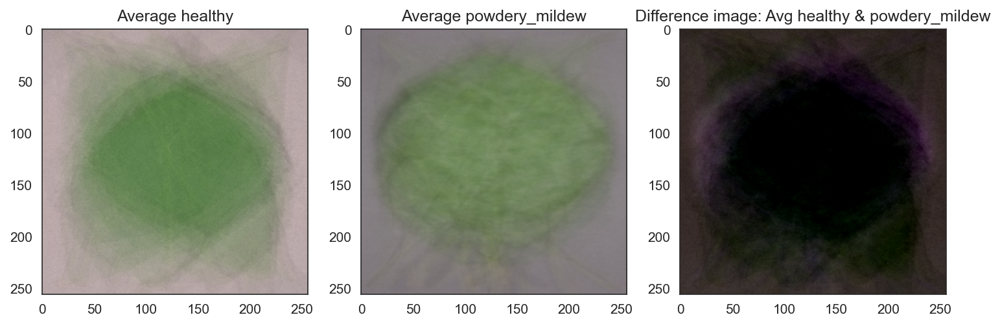

# Cherry Powdery Mildew Detector

[LINK]()

## Project Summary
Cherry Powdery Mildew Detector is a machine learning–based web application designed to help identify powdery mildew infection on cherry leaves using image recognition.

### Powdery Mildew
Powdery mildew is a fungal disease that affects a wide variety of plants, including cherry trees. It is caused by Podosphaera clandestina and appears as white, powdery patches on the surface of leaves, stems, and buds.
These patches result from the growth of fungal hyphae and chains of spores (conidia) on the plant’s surface. Infected leaves may curl, discolor, or fall prematurely, leading to reduced photosynthesis, lower fruit yield, and compromised quality.

The disease spreads rapidly under warm, dry conditions with high humidity and poor air circulation — making early and accurate detection essential to prevent large-scale crop loss.

## Table of Content

## Dataset Content

The dataset consists of 4,208 images of individual cherry leaves captured in controlled conditions. It includes an even split between healthy leaves and those infected with powdery mildew, a fungal disease affecting cherry crops.
All images were sourced from [Kaggle](https://www.kaggle.com/datasets/codeinstitute/cherry-leaves).

## Business Requirements

### Business Case: 
Farmy & Foods, a major agricultural producer, has reported increasing cases of powdery mildew infecting its cherry plantations. The current manual inspection process—where trained staff spend up to 30 minutes per tree visually checking leaves—is slow, subjective, and unscalable across thousands of trees. The company aims to modernize this process through machine learning and image analysis, enabling faster, more accurate detection of infected leaves. The project’s goal is to develop a binary classification model and an interactive Streamlit dashboard that automates this detection, reduces inspection time, and ensures that only high-quality, disease-free produce reaches the market.

### Business Requirement 1 - Visual Study:
The client requires a visual investigation that demonstrates how healthy and infected cherry leaves differ. This study will be displayed on the dashboard and should include:
    - Average and variability images for each class (healthy vs. infected).
    - The difference between the average infected and average healthy leaf images.
    - Image montages showcasing representative examples of each class.

This analysis will help the client visually understand the distinguishing patterns that the model uses to identify powdery mildew.

### Business Requirement 2 - Prediction: 
The client requires a machine learning system capable of predicting whether a cherry leaf is healthy or infected. The system will be accessible through the dashboard and must:
    - Allow users to upload multiple images of cherry leaves.
    - Display for each image a prediction statement with the associated probability of infection.
    - Provide a results table containing filenames and predictions.
    - Include a downloadable report (CSV) of all predictions.

This functionality will allow the client to quickly assess leaf health and generate documented reports directly from the application.

### Risks:
- Large models (>100MB) may require Git LFS (Large file storage) --> model optimization for smaller model
- Heroku/Streamlit Clout support CPU only processing --> Too complex model might cause slow processing

## Hypoteses and Validation

1. Visual Difference Hypothesis
Images of cherry leaves infected with powdery mildew will show distinct visual characteristics—such as white, powdery textures and reduced leaf coloration—compared to healthy leaves.
2. Predictive Capability Hypothesis
A binary image classification model trained on labeled cherry leaf images can accurately distinguish between healthy and infected leaves, achieving ≥97% accuracy on a held-out test set.

1. Validation of Visual Difference Hypothesis

To validate the first hypothesis, a computational process was applied to load, resize, and normalize leaf images, enabling consistent pixel-level comparison across samples. Mean and average representations were then generated for both healthy and infected classes to highlight overall texture and color patterns.
When processing 30 images per label, execution took 0.6 s; increasing to 100 and 200 images raised computation time to 8.0 s and 38.4 s, respectively. The results confirm a clear visual distinction between infected and healthy leaves. Infected samples exhibit more surface irregularities and discoloration. However, as the number of averaged images increases, the visual contrast between the mean representations diminishes, making differences harder for the human eye to detect due to pixel-level smoothing.
The generated visualizations are consistent with prior research on the visual differences between healthy and infected cherry leaves, and they further demonstrate that these differences can be quantified and validated computationally, not just observed visually.

Difference between average healthy and average infected leaves:

Average and Variability (v1, Sample size 30)

Average and Variability (v2,Sample size 200)

Average and Variability (v3, Sample size 100)

2. Validation of Predictive Capability Hypothesis

We validated this hypothesis using a stratified train/validation/test split with strict folder isolation (no augmentation leakage), early stopping, and best-checkpoint selection on validation F1. The final model was evaluated once on the untouched test set: it achieved 100% accuracy with Precision = 1.00, Recall = 1.00, F1 = 1.00, and a confusion matrix showing zero misclassifications across both classes. These results meet—and exceed—the ≥97% accuracy criterion, demonstrating that a binary CNN trained on labeled cherry leaves can reliably distinguish healthy from infected samples.

## Rationale & ML Business Case

The earlier visual analysis confirmed measurable differences in color, texture, and pattern distribution between healthy and infected leaves. This provided empirical support for building a binary image classifier as a reliable detection method.
Convolutional Neural Networks (CNNs) were selected as the primary modeling technique because they are highly effective at learning spatial hierarchies in images without requiring manual feature extraction. This image-based machine learning approach directly addresses Business Requirement 2, ensuring that the solution is both scientifically justified and aligned with the client’s objectives.
By implementing an automated image-based detection system, the client can rapidly identify infected leaves early in the production process, improving response time and minimizing losses.
The model aims for ≥97% accuracy, ensuring reliable predictions that can be integrated into routine field inspections or mobile applications. Beyond operational efficiency, the approach also enables data-driven crop-health monitoring — creating a scalable, low-cost diagnostic tool that supports sustainable agriculture and reduces dependency on manual labor.

### Model Creation and Selection
Building upon the foundation of the Code Institute’s Malaria Detector (a similar binary image classifier), the initial Mildew Detector model adopted a TensorFlow Sequential CNN architecture consisting of three convolutional blocks (Conv2D + MaxPooling2D), followed by Flatten → Dense(128, ReLU) → Dropout → Dense(1, Sigmoid) layers.
Each convolutional block progressively extracts higher-level spatial features — from simple edges and color gradients in the first layer to complex mildew texture patterns in the deeper layers — while MaxPooling reduces spatial dimensions and overfitting risk. The final Dense and Dropout layers transform these learned features into a robust binary decision boundary.

To optimize performance, the following hyperparameters were selected:

- Batch size (16 vs 32): to balance convergence stability and training speed.
- Dropout (0.5 vs 0.3): to control overfitting while maintaining model capacity.
- Kernel size (3×3 vs 5×5): to compare local vs broader texture capture.
- Activation (ReLU vs ELU): While ReLU outputs zero for negative inputs—risking inactive (“dead”) neurons—ELU allows small negative values, preserving gradient flow. This smoother behavior was expected to improve convergence stability and overall model performance compared to ReLU.
- Optimizer (Adam vs Adamax): evaluated for stability and adaptability to varying gradient scales.

Model development followed a four-step experimental process:

- Step 1: Train all 16 hyperparameter combinations with batch size 16 for rapid iteration.
- Step 2: Retrain the top 5 configurations using batch size 32 for refined learning.
- Step 3: Test top 3 configurations using test set for final model selection
- Step 4: Final Validation

#### Step 1 Results Conclusion
- Trained and validated 16 configurations in 67.4 minutes on a modern workstation.
- Planned to advance the top 4, but because the 4th and 5th models were essentially tied, we will retrain the top 5 at batch size 32.
- Top model achieved 100% across all reported metrics on the train/validation sets. Config: bs=16, dropout=0.3, kernel=5, activation=relu, optimizer=adamax, epochs=10.
- Runner-up was nearly identical in performance; key differences vs. #1: kernel 3 (vs 5), activation elu (vs relu), epochs=11 (vs 10).
- Within the top 5, Adamax consistently outperformed Adam; notably, the lowest performers used Adam.
- No other single hyperparameter (dropout rate, kernel size, activation) showed clear, universal dominance beyond the specific winning combinations above.

#### Step 2 Results Conclusion
- Retrained the top 5 configurations from Step 1 at batch size 32; total runtime 30.3 minutes on a modern workstation.
- Used the same selection rule as before — validation accuracy (primary) with validation loss as the tie-breaker — and saved the new leaderboard to reports/grid_report_bs32.csv.
- To finalize selection, we will evaluate the top 3 models on the held-out test set, reporting loss, accuracy, precision, recall, F1, and the confusion matrix for each.
- The best performer on the test set will be promoted as the final model for deployment.

#### Step 3 Results Conclusion
- Evaluated the top 3 candidates from Step 2 on the held-out test set and ranked by test accuracy (primary), with F1 and then loss as tie-breakers.
- Winner (promoted to deployment): step_2_bs32_k3_do0.3_act-elu_opt-adamax_seed27
Config: bs=32, kernel=3, dropout=0.3, activation=elu, optimizer=adamax.
Test performance: accuracy = 1.0000, precision = 1.0000, recall = 1.0000, F1 = 1.0000, loss = 0.00310.
- Runner-ups were close but below perfect accuracy (0.9988 and 0.9964); no tie-breakers were required.
- All deployment artifacts for the winner are recorded (model file, confusion matrix image, and classification report) and ready for packaging into the Streamlit app.

#### Step 4 Final Validation
The accuracy and loss plots clearly demonstrate that the model achieved near-perfect performance, showing minimal loss and flawless convergence throughout training. This is further confirmed by the test set evaluation and the confusion matrix, both indicating 100% accuracy — evidencing that the model successfully learned to distinguish between healthy and infected leaves with complete precision.

## Dashboard Design
- Streamlit App Interface
### Navigation
The Navigation has the following options:
- Quick Project Summary
- Leaves Visualizer
- Mildew Detection
- Project Hypotesis
- ML Performance Metrics
### Project Summary

### Leaves Visualizer

### Mildew Detection

### Project Hypotesis

### Performance Metrics

## CRISP-DM
 Cross-Industry Standard Process for Data Mining
 - A six-phase project methodology that guides from understanding the problem to deploying a model.
 Phases:
 1. Business Understanding
 2. Data Understanding
 3. Data Preparation
 4. Modeling
 5. Evaluation
 6. Deployment

Link to project board

## Bugs
- Although a random seed was defined in the notebooks, it was inadvertently omitted from the model’s implementation due to a minor oversight. This issue was identified during the final validation phase. To ensure the best-performing model was deployed, the production version was manually replaced with the previously trained model that achieved superior validation results.

## Deployment

## Main Data Analysis and Machine Learning Libraries

## Credits
### Content
- CRISP-DM - [LINK](https://en.wikipedia.org/wiki/Cross-industry_standard_process_for_data_mining)
- Cherry Mildew - [LINK](https://hortsense.cahnrs.wsu.edu/fact-sheet/cherry-powdery-mildew/), [LINK](https://www.canr.msu.edu/ipm/diseases/powdery_mildew_of_cherry#gallery), [LINK](https://en.wikipedia.org/wiki/Erysiphaceae)
- Convolutional Neural Networks [LINK](https://en.wikipedia.org/wiki/Convolutional_neural_network), [LINK](https://www.ibm.com/think/topics/convolutional-neural-networks)

Tensor Flow:
Image Classification: https://www.tensorflow.org/tutorials/images/classification
Activation Function:
ELU: https://www.tensorflow.org/api_docs/python/tf/keras/activations/elu
ReLU: https://www.tensorflow.org/api_docs/python/tf/keras/activations/relu
Sigmoid: https://www.tensorflow.org/api_docs/python/tf/keras/activations/sigmoid

Losses:
Binary Crossentropy: https://www.tensorflow.org/api_docs/python/tf/keras/losses/BinaryCrossentropy

Optimizers:
Adam: https://www.tensorflow.org/api_docs/python/tf/keras/optimizers/Adam
Adamax: https://www.tensorflow.org/api_docs/python/tf/keras/optimizers/Adamax

Callbacks:
https://www.tensorflow.org/api_docs/python/tf/keras/callbacks/EarlyStopping
https://www.tensorflow.org/api_docs/python/tf/keras/callbacks/ModelCheckpoint

Code Institute Malaria Detector Walk-through Project Sample was used for:
- Data Collection.ipynb
- Data Visualization.ipynb
- Model Creation - basic model
- Streamlit app files / dashboard structure